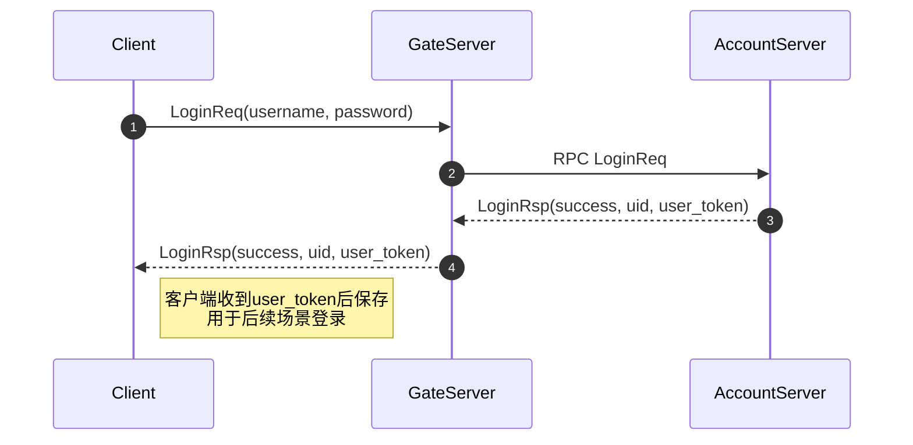
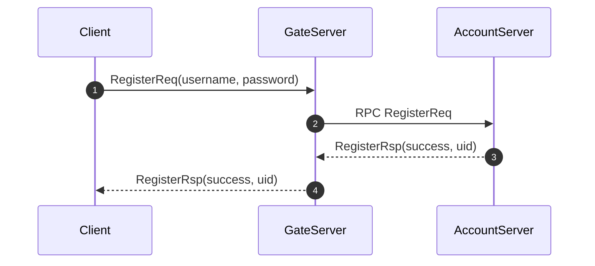
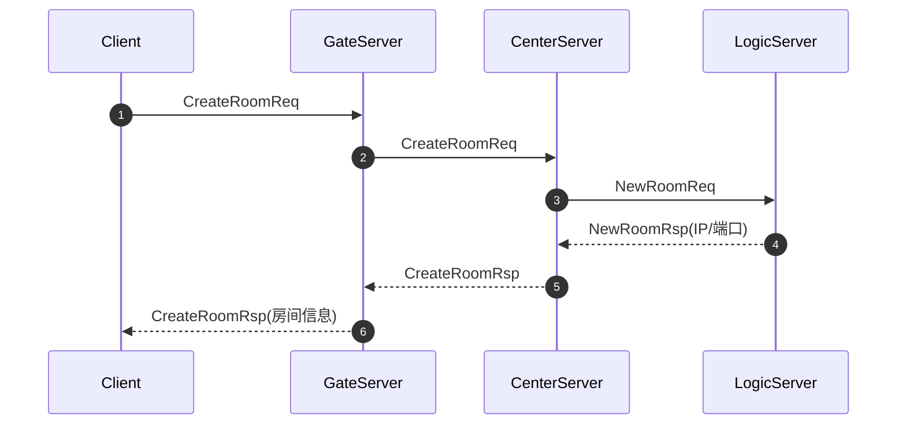
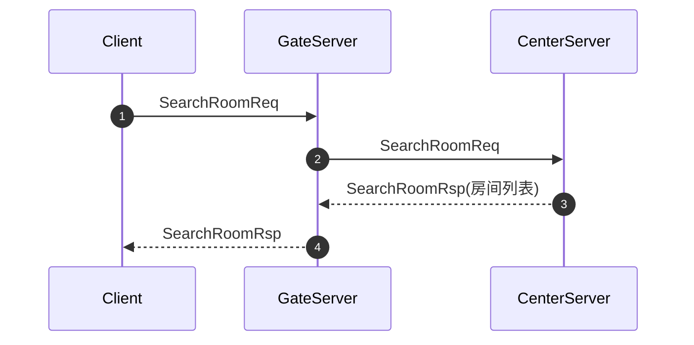
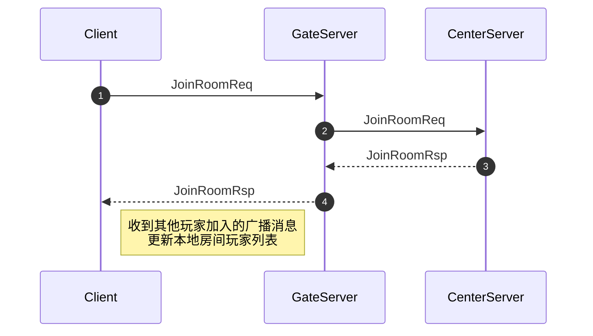
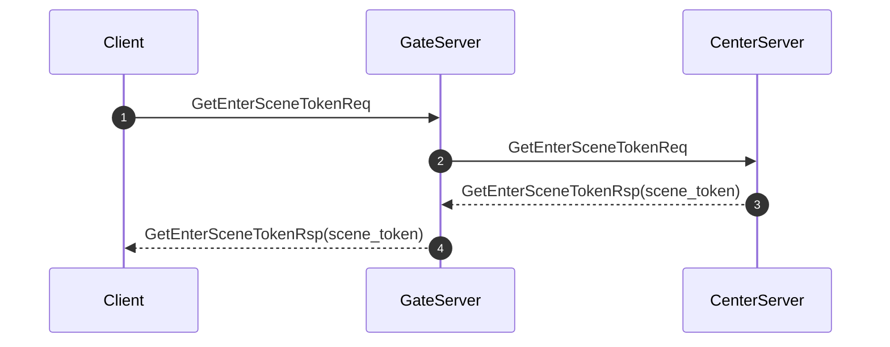
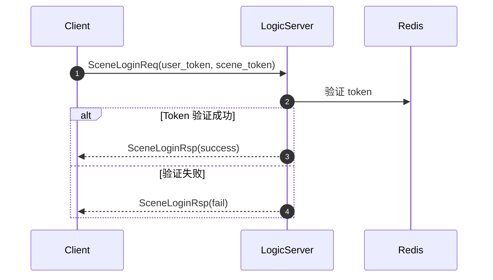
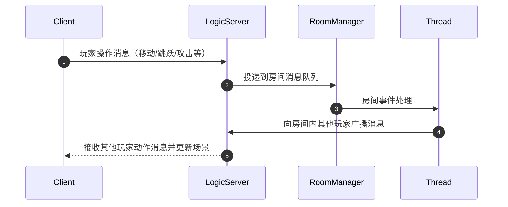
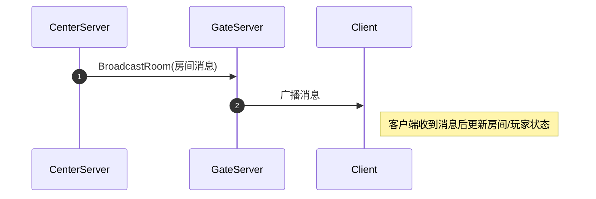

# Unity客户端DEMO

## 项目功能

本客户端基于Unity，配合自研分布式游戏服务端（GateServer / AccountServer / CenterServer / LogicServer）进行多人房间制游戏交互。

1. 用户登录/注册
2. 房间管理（创建/搜索/加入/退出）
3. 场景登录与游戏内操作
4. 断线重连与数据同步
5. 消息广播接收

### 1️⃣ 登录与注册模块

#### 登录流程

#### 注册流程

### 2️⃣ 房间管理模块

#### 创建房间

#### 搜索房间

#### 加入房间

#### 退出房间

### 3️⃣ 场景登录与游戏内操作

#### 获取逻辑服场景令牌

#### 逻辑服登录（Token 验证）

#### 游戏内操作与消息同步

### 4️⃣ 广播消息接收

客户端接收中心服或逻辑服广播的房间消息（例如其他玩家加入/退出、游戏事件广播）：

